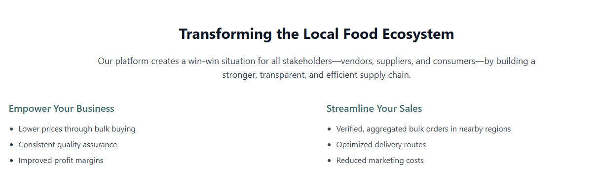

BoliBazaar – Empowering Local Street Vendors Through Smart Sourcing
BoliBazaar is a digital platform designed to streamline the procurement process for local street food vendors in India by enabling collective bargaining and bulk purchasing from trusted suppliers.

✅ Verified Suppliers
What it means:
All suppliers on BoliBazaar are thoroughly vetted before they’re allowed to sell. This includes checking:

Business legitimacy (registration, GST, etc.)

Product quality standards

Delivery reliability (on-time performance)

Past vendor reviews and ratings

Why it matters:
Street food vendors and small businesses often suffer due to unreliable or low-quality suppliers. BoliBazaar ensures only trusted and approved suppliers can take part, which minimizes risks and builds long-term trust in the supply chain.

🔍 Transparent Bidding
What it means:
Suppliers compete openly by submitting bids for bulk orders placed by vendor collectives. Every vendor can see:

Which suppliers are bidding

What prices are being offered

What terms (delivery time, quality standards, etc.) are included

Why it matters:
This removes hidden commissions or biased middlemen. Vendors get the best possible price and quality through direct, fair competition—empowering even the smallest vendor to negotiate like a big buyer.

🌍 Local Focus
What it means:
Vendors are grouped based on geographic proximity (like same city or market), and suppliers are encouraged to deliver to specific local zones. This system:

Reduces transport costs

Increases delivery speed

Simplifies coordination

Why it matters:
Fresh raw materials, especially in food businesses, need quick delivery. Localized operations mean faster, cheaper, and more reliable supply chains, helping vendors run their businesses smoothly without delays or losses.

🚀 How BoliBazaar Works — Step-by-Step
✅ 1. Form Local Collectives
Street food vendors, restaurant owners, or small businesses in the same locality connect via the platform and form a collective group.
This gives them greater bargaining power—instead of ordering individually, they act like one big buyer.

📦 Example: 10 vendors in Chandni Chowk join hands to place one large order instead of 10 small ones.

📋 2. Create Bulk Orders
These collectives pool their raw material needs—like vegetables, spices, oil, packaging, etc.—into one combined order.
The system automatically calculates the total quantity and creates a bulk order request.

🧮 Why it helps: Bulk buying reduces price per unit, and attracts more serious suppliers.

🤝 3. Suppliers Compete
Once a bulk order is created, verified suppliers on the platform are notified.
They submit bids by offering:

A competitive price

Delivery timeline

Product quality guarantee

All bids are visible to the collective, encouraging transparent and fair competition.

🏆 4. Secure the Best Deal
The system or the collective automatically selects the best supplier based on:

Lowest price

Delivery time

Supplier reputation

Once selected, the winning supplier delivers the order to the collective, completing the transaction.

🛒 Result: Vendors get high-quality materials at a better rate, with trust and transparency.

Tech Stack

Purpose
To reduce the burden on small vendors who often face high costs and limited access to quality suppliers. BoliBazaar helps them save money, increase trust, and buy smarter together.

